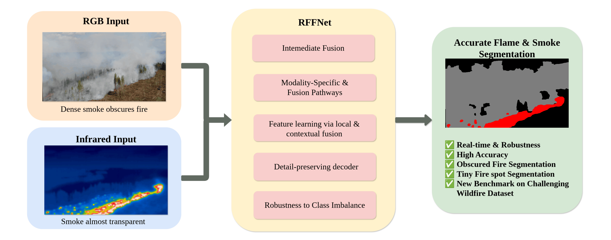
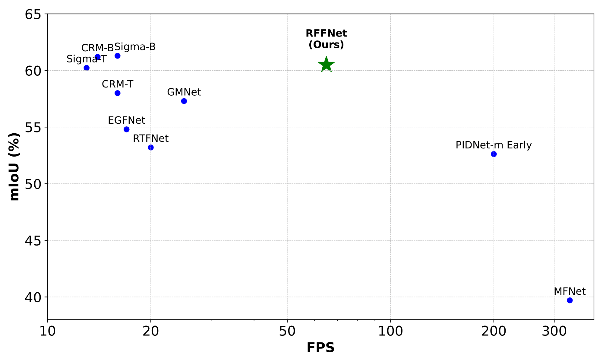
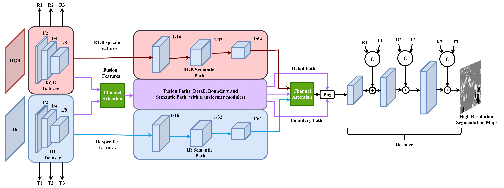
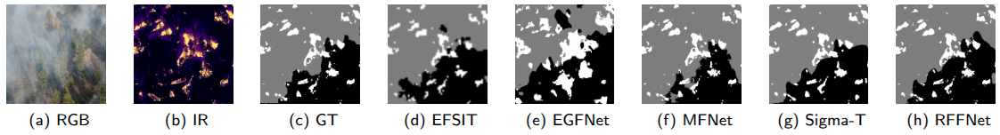
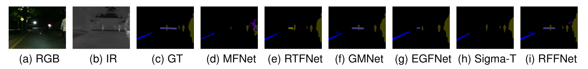

# RoboFireFuseNet

This is the official repository for **RoboFireFuseNet: Robust Fusion of Visible and Infrared Wildfire Imaging for Real-Time Flame and Smoke Segmentation** published in **Pattern Recognition Letters** (doi: 10.1016/j.patrec.2026.04.024). 

Developed for the fire segmentation module of the EU Horizon TEMA project, RoboFireFuseNet is a high-efficiency neural network designed for edge deployment. It targets three fundamental computer vision hurdles: small object segmentation, extreme class imbalance, and asymmetric RGB-IR fusion under inter-modality occlusion. This specialized fusion architecture ensures robust feature integration even when one sensor’s line of sight is obstructed, allowing the model to maintain peak performance in real time.

<div align="center">
  
  
</div>

## Abstract
Concurrent image segmentation of flames and smoke is challenging, as smoke frequently obscures fire in standard
RGB imagery, necessitating the use of other spectral bands such as Infrared (IR). Existing multimodal models are
either too computationally demanding for real-time deployment or too lightweight to capture small sparse fire
patterns that may escalate into large wildfires. Moreover, they are typically trained and validated on simplistic
datasets, such as Corsican or FLAME1, which lack the dense smoke occlusion present in real-world scenarios. We
introduce RoboFireFuseNet (RFFNet), a real-time deep neural network that fuses RGB and IR data using attention
mechanisms, a detail-preserving decoder, and class-balance training techniques. RFFNet establishes a benchmark
on challenging, realistic wildfire datasets with dense smoke, creating a foundation for practical comparison in
future wildfire segmentation research. Despite its lightweight design, it also achieves state-of-the-art results on
a general urban benchmark, demonstrating versatility. Its combination of accuracy, real-time performance, and
multimodal fusion makes RFFNet well-suited for proactive and accurate wildfire monitoring.

<div align="center">
   <h4>MIOU vs FPS on MFNet dataset and RTX 4090</h4>
  
</div>

## Highlights

- 🔄 **Hybrid Multimodal Architecture**: Integrates SwinV2-T Transformer blocks within a PIDNet-Small backbone <sup>[[1]](#1)</sup>. This dual-pathway design preserves modality-specific (RGB-IR) representations while capturing long-range global dependencies for robust feature fusion.
- ⚡ **Real-Time Inference Optimization**: Engineered for high-throughput deployment in proactive UAV/drone-based monitoring. Achieves strict real-time processing speeds on consumer hardware without sacrificing segmentation integrity.
- 🔥 **Robust Target Extraction**: Employs a detail-preserving U-Net-style decoder tailored for sparse, fine-grained fire patterns. Maintains exceptionally high recall and spatial reconstruction accuracy even under severe, real-world smoke occlusion.
- 🎯 **Parameter-Efficient Design**: Attains state-of-the-art accuracy with only 29.5M parameters. It robustly handles both smoke-occluded wildfire scenarios (88.17% MIoU on FLAME2) and datasets featuring small targets and severe class imbalance (60.6% MIoU on MFNet), offering a vastly superior compute-to-accuracy ratio.


## Model Architecture
Our model enhances PIDNet-Small by integrating SwinV2-T Transformer blocks, improving capacity and capturing long-range dependencies. To better preserve and extract modality-specific features, we introduce dedicated modality pathways. Additionally, we replace basic upscaling with a U-Net-style decoder, enhancing spatial reconstruction and producing high-resolution segmentation maps.



## Experiments

### 📊 **Performance Comparison on FLAME2**
| **Method**                | **Avg Recall (%)** | **MIoU (%)** | **Params (M)** |
|--------------------------|-------------------|---------------|-----------------|
| [PIDNet-RGB](https://github.com/XuJiacong/PIDNet)  | 75.66            | 61.21         | 34.4            |
| [PIDNet-IR](https://github.com/XuJiacong/PIDNet)   | 83.05            | 58.71         | 34.4            |
| [PIDNet-Early](https://github.com/XuJiacong/PIDNet) | 88.25            | 73.90         | 34.4            |
| [MFNet](https://github.com/haqishen/MFNet-pytorch)        | 93.53            | 80.26         | **0.73**         |
|[EFSIT*](https://github.com/hayatkhan8660-maker/Fire_Seg_Dataset)  | 90.15 | 80.09 |  4.8 |
| [RTFNet](https://github.com/yuxiangsun/RTFNet)      | 73.87            | 65.42         | 185.24          |
| [GMNet](https://github.com/Jinfu0913/GMNet)      | 67.53            | 54.08         | 153             |
| [EGFNet](https://github.com/ShaohuaDong2021/EGFNet)     | 74.27            | 60.98         | 62.5            |
| [CRM-T](https://github.com/UkcheolShin/CRM_RGBTSeg)      | -                | -             | 59.1            |
| [Sigma-T](https://github.com/zifuwan/Sigma)     | 92.6             | 86.27         | 48.3            |
| **Ours**                            | **94.37**        | **88.17**     | 29.5            |



### 📊 **Performance Comparison on Urban Scenes (MFNet)**
| **Method**                | **Avg Recall (%)** | **MIoU (%)** | **Params (M)** |
|--------------------------|-------------------|---------------|-----------------|
| [PIDNet-m RGB](https://github.com/XuJiacong/PIDNet)  | 65.59            | 51.52         | 34.4            |
| [PIDNet-m IR](https://github.com/XuJiacong/PIDNet)   | 65.27            | 50.70         | 34.4            |
| [PIDNet-m Early](https://github.com/XuJiacong/PIDNet) | 69.59            | 52.62         | 34.4            |
| [MFNet](https://github.com/haqishen/MFNet-pytorch)          | 59.1             | 39.7          | **0.73**         |
| [RTFNet](https://github.com/yuxiangsun/RTFNet)        | 63.08            | 53.2          | 185.24          |
| [GMNet](https://github.com/Jinfu0913/GMNet)        | **74.1**         | 57.3          | 153             |
| [EGFNet](https://github.com/ShaohuaDong2021/EGFNet)       | 72.7             | 54.8          | 62.5            |
| [CRM-T](https://github.com/UkcheolShin/CRM_RGBTSeg)        | -                | 59.7          | 59.1            |
| [Sigma-T](https://github.com/zifuwan/Sigma)       | 71.3             | 60.23         | 48.3            |
| **Ours**                                             | 71.1             | **60.6**      | 29.5            |



## Usage

### 0. Setup
- Install python requirements: `pip install -r requirements.txt` or recommender `Python 3.10.12`
- Download the [weights](https://drive.google.com/drive/folders/1wldeSDx5VVjynABJqm55RDREAnPonk5y?usp=sharing) inside the weights folder.
- Download the preprocessed [data](https://drive.google.com/drive/folders/15bsStvQWBpMY1bXW3Wi-uliczz1-Zko8?usp=drive_link) inside the data folder. We include our annotations on subset of public FLAME2 dataset <sup>[[2]](#2)</sup> (see Licensing for details), preprocessed MFNet dataset <sup>[[3]](#3)</sup>.
- Download the [split](https://drive.google.com/file/d/15zglyds0vFhUJmwbwXorlszqs5jZ-ga7/view?usp=sharing) for Corsican <sup>[[4]](#4)</sup> and also download the original Corsican from original site.
  
### 2. Training
Customize configurations via the config/ folder or override them with inline arguments.
- train fusion model on wildfire: 
```bash
python train.py --yaml_file wildfire.yaml --LR 0.001 --BATCHSIZE 5 --WD 0.00005 --SESSIONAME "train_simple" --EPOCHS 500 --DEVICE "cuda:0" --STOPCOUNTER 30 --ONLINELOG False --PRETRAINED "weights/pretrained_480x640_w8_2_6.pth" --OPTIM "ADAM" --SCHED "COS"
```

- train fusion model on urban dataset: 
```bash
python train.py --yaml_file urban.yaml --LR 0.001 --BATCHSIZE 5 --WD 0.00001 --SESSIONAME "train_simple" --EPOCHS 500 --DEVICE "cuda:0" --STOPCOUNTER 30 --ONLINELOG False --PRETRAINED "weights/pretrained_480x640_w8_2_6.pth" --OPTIM "ADAM" --SCHED "COS"
```
  
### 3. Testing
Customize configurations via the config/ folder or override them with inline arguments.
- test fusion model on wildfire: 
```bash
python test.py --yaml_file wildfire.yaml --SESSIONAME "train_simple" --DEVICE "cuda:0" --PRETRAINED "weights/robo_fire_best.pth"
```
- test fusion model on urban dataset: 
```bash
python test.py --yaml_file urban.yaml --SESSIONAME "train_simple" --DEVICE "cuda:0" --PRETRAINED "weights/robo_urban.pth"
```
- To run the demo with custom images, place your files in the outputs/demo folder using the following naming conventions:     `<prefix>_rgb_<postfix>.png` for RGB images, `<prefix>_ir_<postfix>.png` for IR images, and a `.txt` file with rows formatted as `<prefix>_XXX_<postfix>.png`. Replace `<prefix>` and `<postfix>` with any values, ensuring `rgb` and `ir` indicate the modality. Optionally, include ground truth files named `<prefix>_gt_<postfix>.png` to calculate metrics. Run the demo using `python test.py --yaml_file wildfire_demo.yaml` for the wildfire demo or `python test.py --yaml_file urban_demo.yaml for the urban demo` for urban one. If you use custom `.txt` file instead of `demo_fire.txt` and `demo_urban.txt` adjust the YAML config files.

## Citation
If you find this code or research helpful in your work, please cite our paper:

**Plain Text:**
> Fotiou, D., Mygdalis, V., & Pitas, I. (2026). RoboFireFuseNet: Robust fusion of visible and infrared wildfire imaging for real-time flame and smoke segmentation. *Pattern Recognition Letters*, 205, 87–93. https://doi.org/10.1016/j.patrec.2026.04.024

**BibTeX:**
```bibtex
@article{FOTIOU202687,
  title = {RoboFireFuseNet: Robust fusion of visible and infrared wildfire imaging for real-time flame and smoke segmentation},
  journal = {Pattern Recognition Letters},
  volume = {205},
  pages = {87-93},
  year = {2026},
  issn = {0167-8655},
  doi = {10.1016/j.patrec.2026.04.024},
  url = {[https://www.sciencedirect.com/science/article/pii/S0167865526001479](https://www.sciencedirect.com/science/article/pii/S0167865526001479)},
  author = {Dimitrios Fotiou and Vasileios Mygdalis and Ioannis Pitas},
  keywords = {Wildfire, Segmentation, Multimodal, Infrared}
}
```

## Acknowledgment

This research was funded by the European Union’s Horizon Europe research and innovation programme under the **TEMA** project (Grant Agreement No. 101093003, HORIZON-CL4-2022-DATA-01-01).

## References

<a id="1">[1]</a> : PIDnet: Xu, Jiacong et al. “PIDNet: A Real-time Semantic Segmentation Network Inspired by PID Controllers.” 2023 IEEE/CVF Conference on Computer Vision and Pattern Recognition (CVPR) (2022): 19529-19539. </br>
<a id="2">[2]</a> : Bryce Hopkins, Leo O'Neill, Fatemeh Afghah, Abolfazl Razi, Eric Rowell, Adam Watts, Peter Fule, Janice Coen, "FLAME 2: Fire detection and modeLing: Aerial Multi-spectral imagE dataset", IEEE Dataport, August 30, 2022, doi:10.21227/swyw-6j78 </br>
<a id="3">[3]</a> : Q. Ha, K. Watanabe, T. Karasawa, Y. Ushiku and T. Harada, "MFNet: Towards real-time semantic segmentation for autonomous vehicles with multi-spectral scenes," 2017 IEEE/RSJ International Conference on Intelligent Robots and Systems (IROS), Vancouver, BC, Canada, 2017, pp. 5108-5115, doi: 10.1109/IROS.2017.8206396.
</br> 
<a id="4">[4]</a> : Tom Toulouse, Lucile Rossi, Antoine A Campana, Turgay A Celik, Moulay A Akhloufi. Computer vision
for wildfire research: An evolving image dataset for processing and analysis. Fire Safety Journal, 2017, 92,
pp.188-194. ⟨10.1016/j.firesaf.2017.06.012⟩. ⟨hal-01560570⟩

## Licences

The code and segmentation masks for FLAME2 in this repository are licensed under the **MIT License**. 

This repository contains subsets of the following third-party datasets:

1. **FLAME 2 Dataset <sup>[[2]](#2)</sup>:** Used and redistributed under the **CC BY 4.0 license** (Hopkins et al., 2022). [Source](https://ieee-dataport.org/open-access/flame-2-fire-detection-and-modeling-aerial-multi-spectral-image-dataset)
2. **MFNet Dataset <sup>[[3]](#3)</sup>:** Used for research and benchmarking purposes (Ha et al., 2017). The original images are provided by the University of Tokyo, Harada Lab. [Source](https://www.mi.t.u-tokyo.ac.jp/static/projects/mil_multispectral/)
